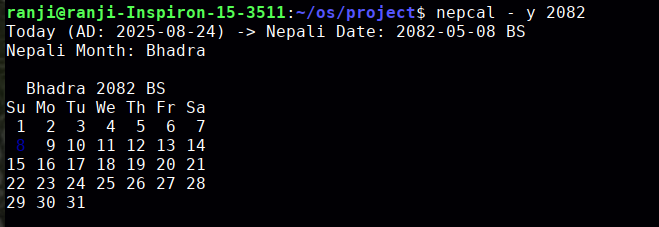

# BS Calendar (Nepali Calendar) CLI Tool

  

We have created a **Bikram Sambat (BS) calendar** for daily life use cases.

Direct conversion from AD (Gregorian) to BS is not always intuitive, so our goal is to make it easier to **view dates in BS directly from the command line**.

  

With the `nepcal` command, users can specify **year (-y)**, **month (-m)**, and **day (-d)** to quickly see the corresponding BS date and its calendar.

  

---

  

## Features

  

- Convert **any AD date** to **BS** (within 2050–2090 BS range).

- Print **full month calendar** in BS with optional **highlighted day**.

- Display **Nepali month name** along with the date.

- Easy-to-use **command-line interface**.

---

## Installation

  
1. Clone or copy the repository to your machine.

2. Compile the C program:

```

gcc nep_cal.c -o nepcal
chmod +x nepcal
sudo mv nepcal /usr/local/bin/

```

  

#### Usage
```
nepcal [options]
```
  

Options

  
```
-y YEAR : Specify BS year (2050–2090)
-m MONTH: Specify BS month (1–12)
-d DAY : Specify day of the month
```
  

Examples

  

Today’s date (default):

  

nepcal

  
  

Display a specific year:
nepcal -y 2082
Display a specific month:
nepcal -y 2080 -m 5
Display a specific day:
nepcal -y 2080 -m 1 -d 15
Output Example


### Notes
- The program works only for BS years 2050–2090 (inclusive).
- It highlights the specified day in blue color for easy reference.
- The calendar can be extended or updated by modifying the nepali_month_days table.